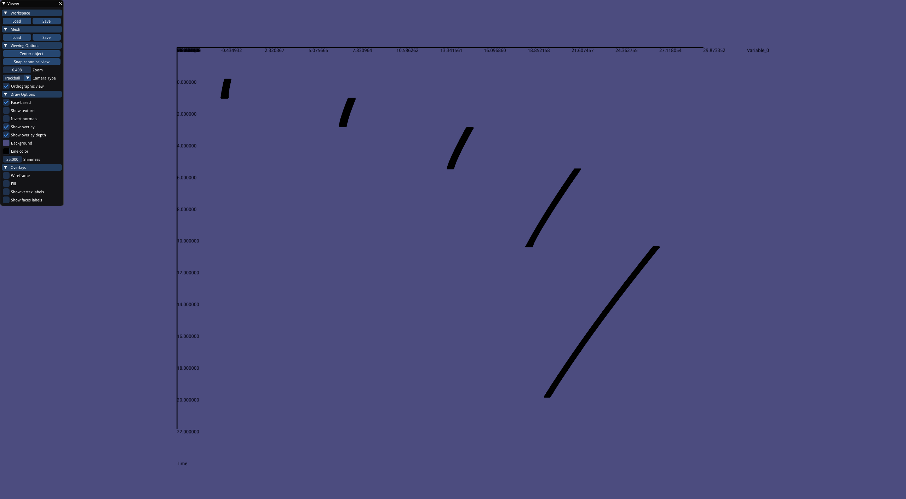
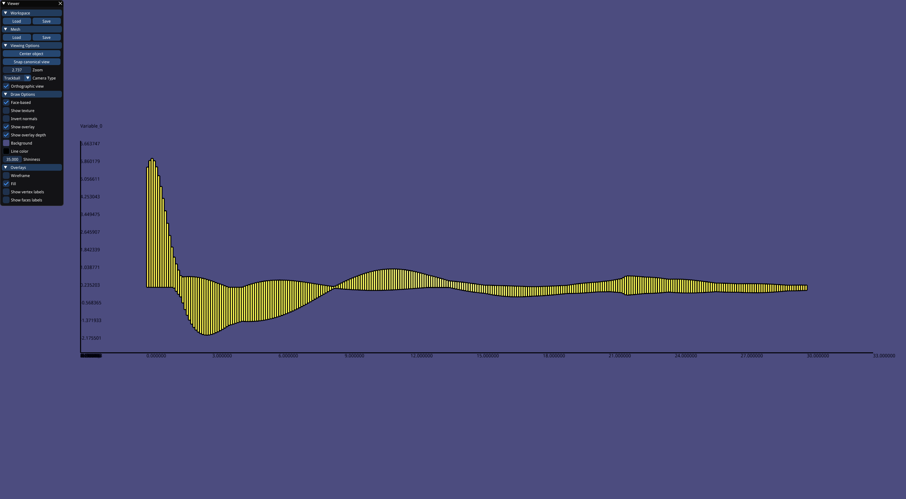
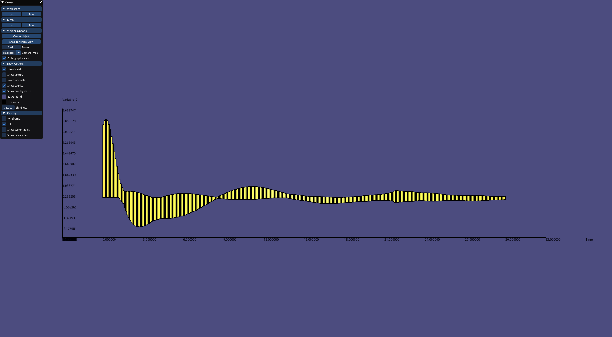
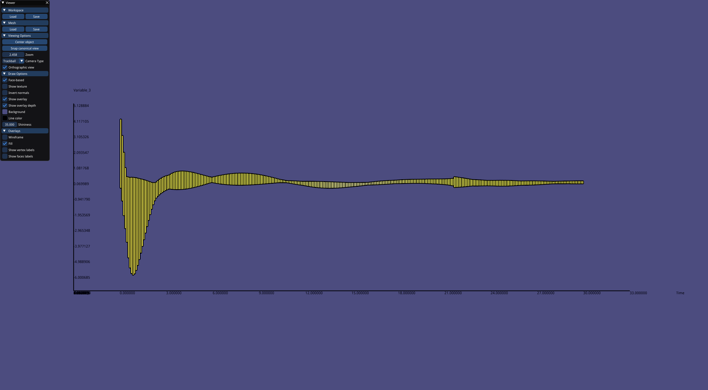
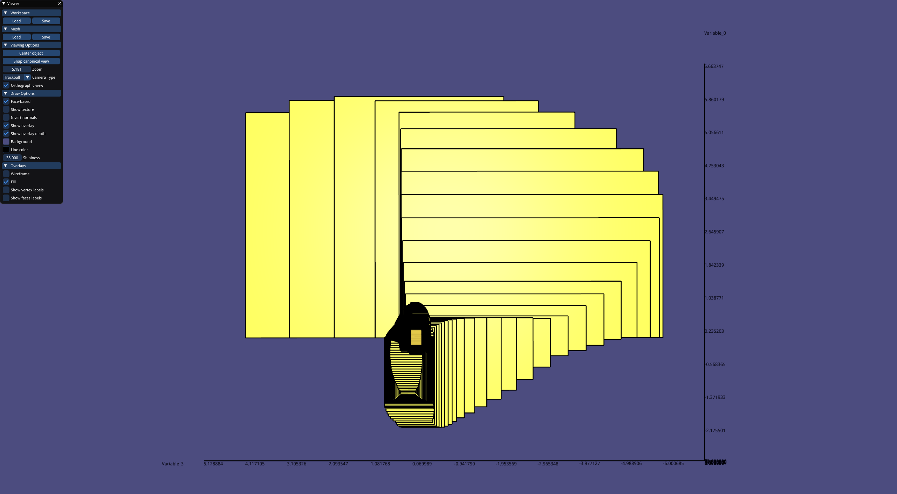
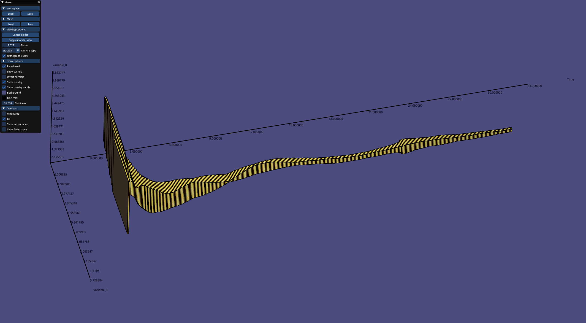
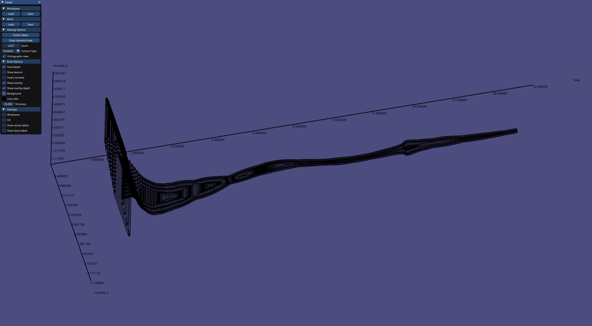
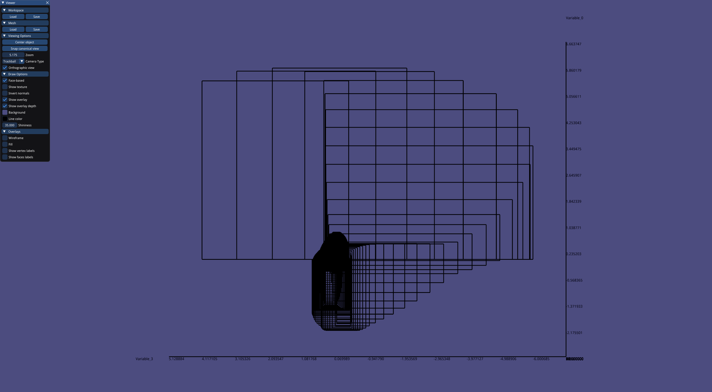

The IraFhy is designed for perform reachability analysis of hybrid systems.

## Getting Started

These instructions will get you a copy of the project up and running on your local machine for development and testing purposes.

### Prerequisites

|   Library   |                             URL                             | Version  |
| :---------: | :---------------------------------------------------------: | :------: |
|    Eigen    |    http://eigen.tuxfamily.org/index.php?title=Main_Page     |  3.3.4   |
|    CMake    |                     https://cmake.org/                      |  latest  |
|    GLPK     |             https://www.gnu.org/software/glpk/              |  4.65-2  |
|   FILIB++   | http://www2.math.uni-wuppertal.de/wrswt/software/filib.html |  3.0.2   |
|    boost    |                   https://www.boost.org/                    | 1.67.0.0 |
|   Doxygen   |                   http://www.doxygen.nl/                    |  1.8.13  |
|   Grapviz   |                  https://www.graphviz.org/                  | 2.40.1-5 |
| Google Test |            https://github.com/google/googletest             |  1.8.1   |
|    Qhull    |               https://github.com/qhull/qhull                |  7.2.1   |
|    FLANN    |            https://www.cs.ubc.ca/research/flann/            |  1.9.1   |
|    Antlr    |                   https://www.antlr.org/                    |  4.7.2   |
|   libigl    |            https://github.com/libigl/libigl.git             |  latest  |
|   OpenMP    |                   https://www.openmp.org/                   |  latest  |

### Build

```
mkdir build && cd build
cmake .. (-DENABLE_TESTING=1 -DENABLE_EXAMPLES=1 -DENABLE_DOC=1)
make
make install (if needed)
```

### Generate document

```
mkdir build && cd build
...
make
make doc
```

### Running the tests

```
mkdir build && cd build
...
make
make test
```

## Examples
```
insert some images and related introduction
```
















## TODO List
```
#0410 refine the constraints satisfaction problem solver
#0411 refine the plotter
#0412 extend the ODE solver to DDE solver
#0413 extend the ODE solver with time variant ODEs
```

## Authors

* **Jianqiang Ding** - *Program Engineer* - <jq.ding.szu@gmail.com>
* **Bai Xue** - *Corresponding Author* - [Homepage](http://lcs.ios.ac.cn/~xuebai/index.html)

See also the list of [contributors](https://github.com/project/contributors) who participated in this project.

## License

This project is licensed under the [TODO] License - see the [LICENSE](LICENSE.md) file for details

## Acknowledgments

* TODO