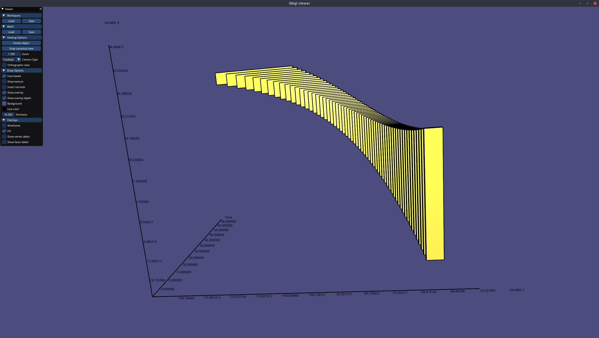
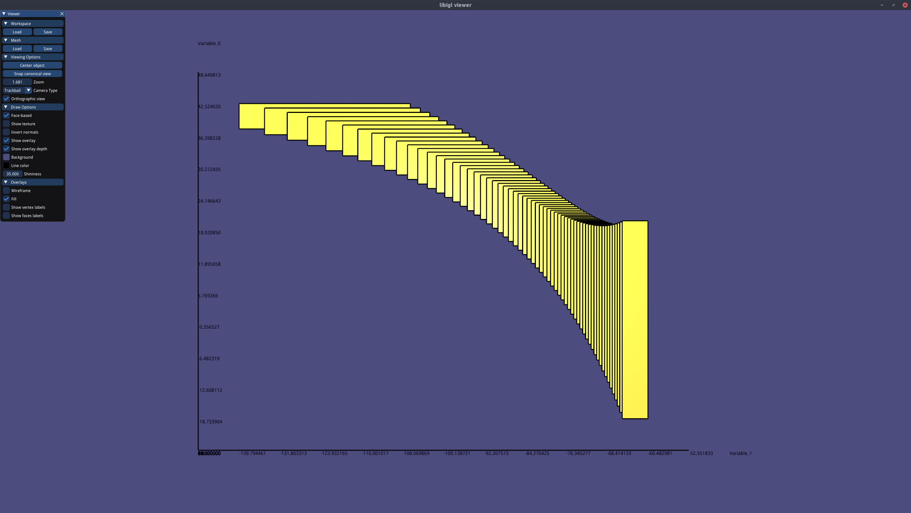
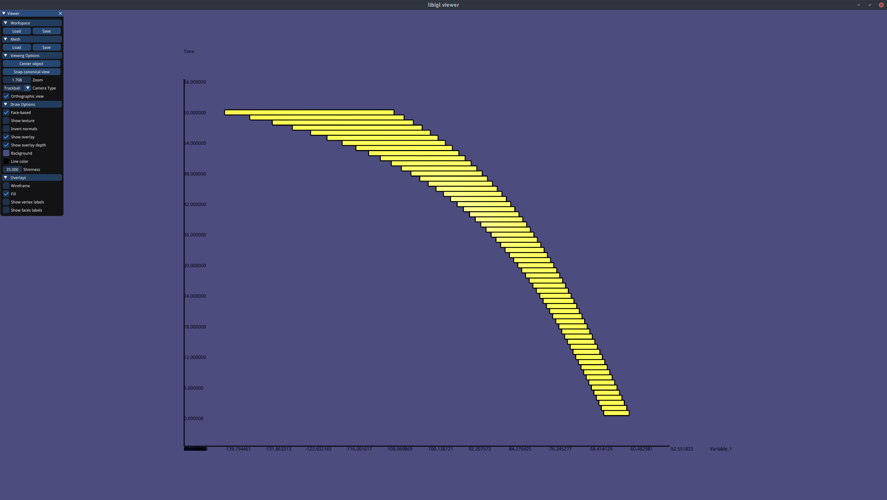
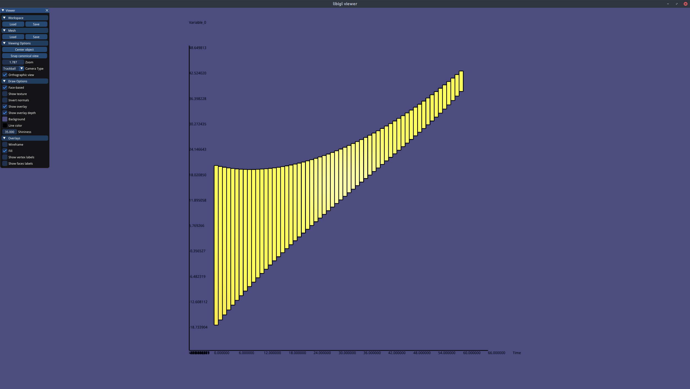

# under approximation backward reach-ability analysis of Spiking Neuron Model using interval hull  {#example_2}

## System

```html
HYBRID_AUTOMATON
{
    NAME Spiking Neuron Model

    VARIABLES
    {
        u v
    }

    LOCATIONS
    {
        MODEL
        {
            NAME l
            FLOWS
            {
                u'=0.02*(0.2*v-u)
                v'=0.04*v^2+5*v+140-u+40
            }
            INVARIANT_CONDITIONS
            {
                CONDITION
                {
                    INTERVAL_HULL
                    {
                        [-INF,+INF],
                        [-INF,30]
                    }
                }
            }
        }
    }

    TRANSITIONS
    {
        JUMP
        {
            DIRECTION l -> l
            GUARD_CONDITIONS
            {
                CONDITION
                {
                    INTERVAL_HULL
                    {
                        [-INF,+INF],
                        [30,+INF]
                    }
                }
            }
            RESET_MAP
            {
                u := u+8
                v := -65
            }
        }
    }
}
```

## Setting

```html
SETTINGS
{
    TIME_HORIZON := [0,1.2]
    STEP := 0.02
    GEOMETRY := INTERVAL_HULL
    PLOT := ON
    PRINT := OFF
    ANALYSIS := FORWARD #invalid setting, we force backward in the Analyser
    MAX_JUMP := 100
    START_MODEL_ID := l #name of the model
    INITIAL_CONDITION :=
    CONDITION
    {
             INTERVAL_HULL
             {
             [-0.2,0.2],
             [-65,-60]
             }
    }
}
```

## Result

here are some screenshots of the results

<p align="center">
    
</p>

<p align="center">
    
</p>

<p align="center">
    
</p>

<p align="center">
    
</p>

