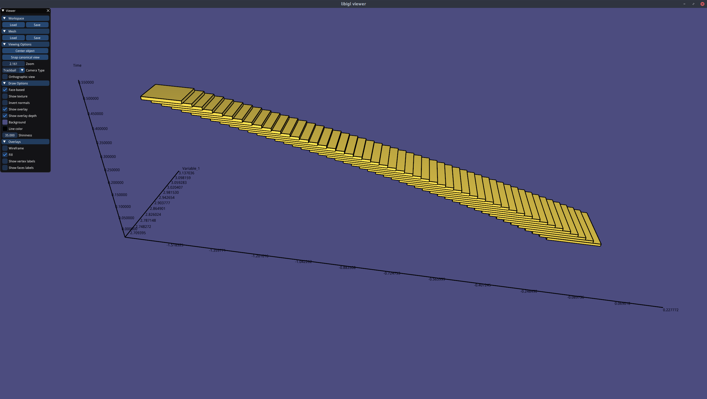
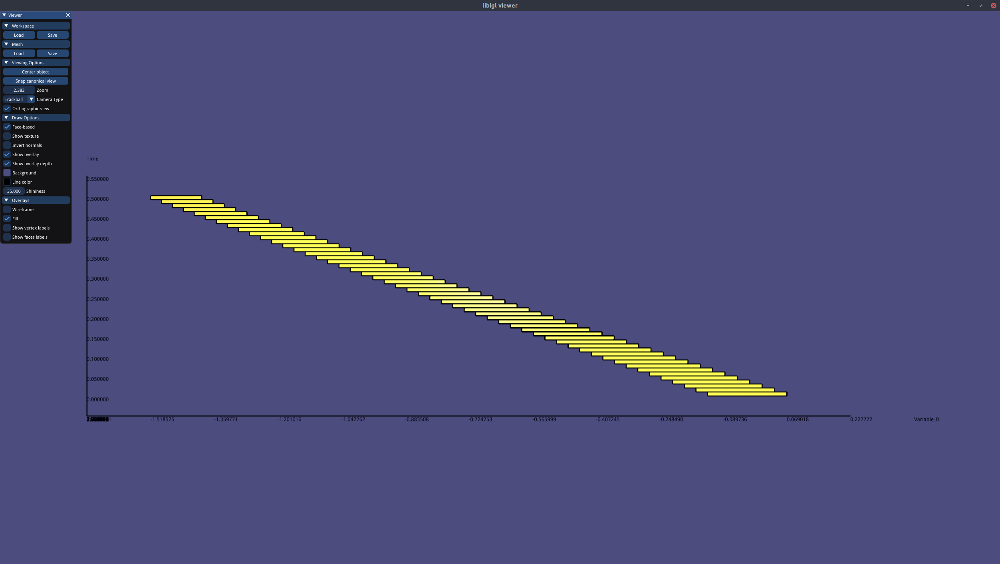
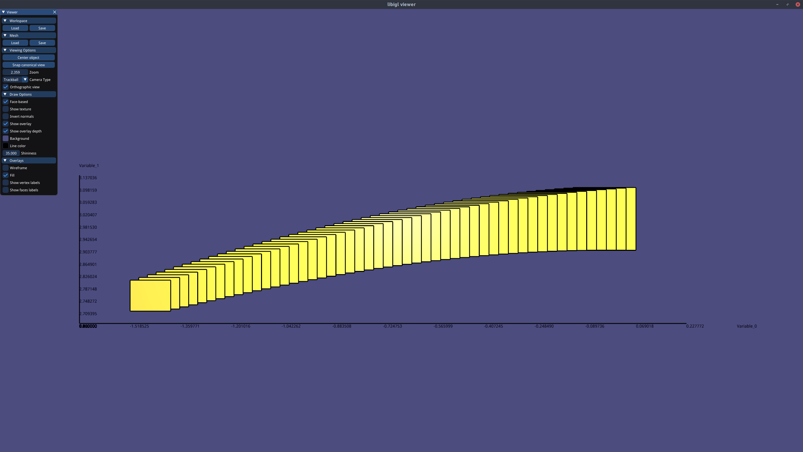
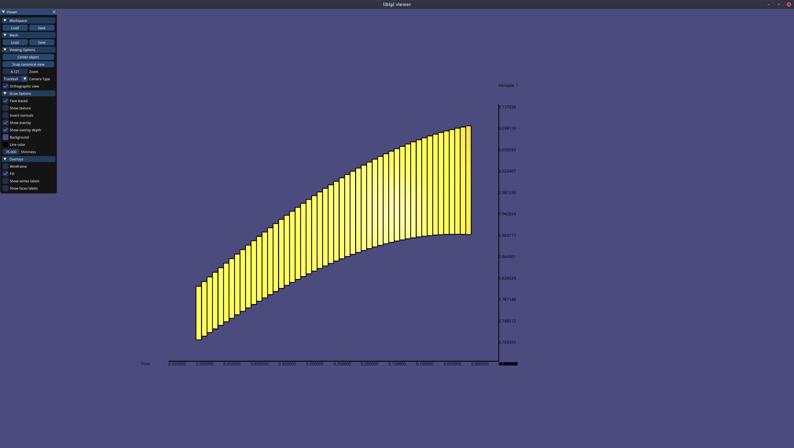

# under approximation backward reach-ability analysis of example 3 using interval hull  {#example_3}

## System

```html
HYBRID_AUTOMATON
{
    NAME Example Model

    VARIABLES
    {
        x1, x2
    }

    LOCATIONS
    {
        MODEL
        {
            NAME controller
            FLOWS
            {
                x1' = x2
                x2' = 0.2-0.7*sin(x1)-0.05*x2
            }
            INVARIANT_CONDITIONS
            {
            }
        }
    }

    TRANSITIONS
    {
    }
}
```

## Setting

```html
SETTINGS
{
    TIME_HORIZON := [0,0.5]
    STEP := 0.01
    GEOMETRY := INTERVAL_HULL
    PLOT := ON
    PRINT := OFF
    ANALYSIS := FORWARD #invalid setting, we force backward in the Analyser
    MAX_JUMP := 1
    START_MODEL_ID := controller #name of the model
    INITIAL_CONDITION :=
    CONDITION
    {
             INTERVAL_HULL
             {
             [-0.1,0.1],
             [2.9,3.1]
             }
    }
}
```

## Result

here are some screenshots of the results

<p align="center">
    
</p>

<p align="center">
    
</p>

<p align="center">
    
</p>

<p align="center">
    
</p>