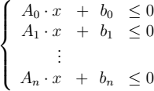

# Formal {#formal}

## Condition

is designed as the general formal representation of the geometry
objects used in computing. the entity of the condition can be interval hull, polytope or any other geometry objects shall be supported in the future.

## Constraint

is desigened as the general formal representation of the set of
state. it is mainly used in declaring a geometric state set formally. e.g. you
can define the polytope using formulations as following:

 

    

which defines a convex hull as a polytope (halfspaces defined).

## System

is designed to support describing continuous dynamic system formally. the systme responsible for receiving the formal description of a system outside and generating the functions can be solved by the ODE solver inside.
It is pretty simple to define a continuous dynamic system, all you need to
do is writing down all the functions into the congurating file like [examples](@ref example) do, the configuration will be parsed, and the system will be constructed by the parser automatically.

## Hybrid Automaton

is implemented as [deterministic finite automaton](https://en.wikipedia.org/w/index.php?title=Deterministic_finite_automaton&oldid=915398161) inside. A hybrid automaton is a tuple

**H = (Locations,Variables,Flow,Invariants,Transitions,Initialization)**

**Location** a finite set of discrete states which are also called control modes

**Variables** a finite ordered set of real-valued variables

**Flow** continuous dynamics associate with each mode defined by ordinary differential equations

**Invariants** state set which associates assigned to each mode

**Transitions** finite set of discrete transitions which specify jumps among modes

**Initialization** initial state set of the starting mode of the automaton