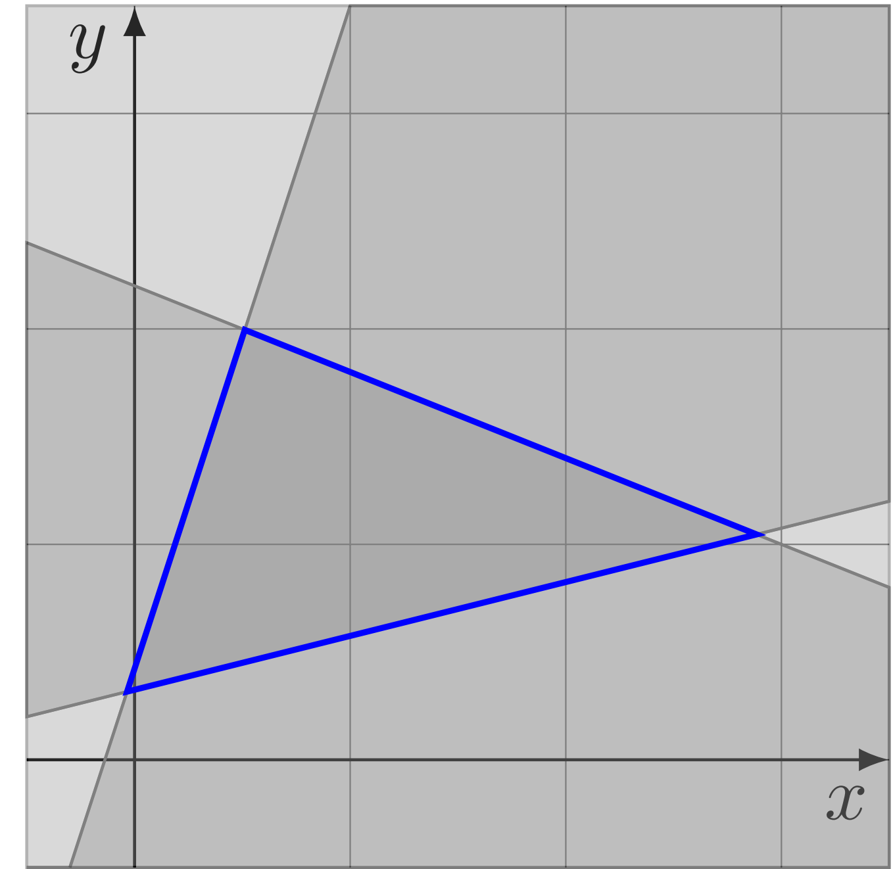
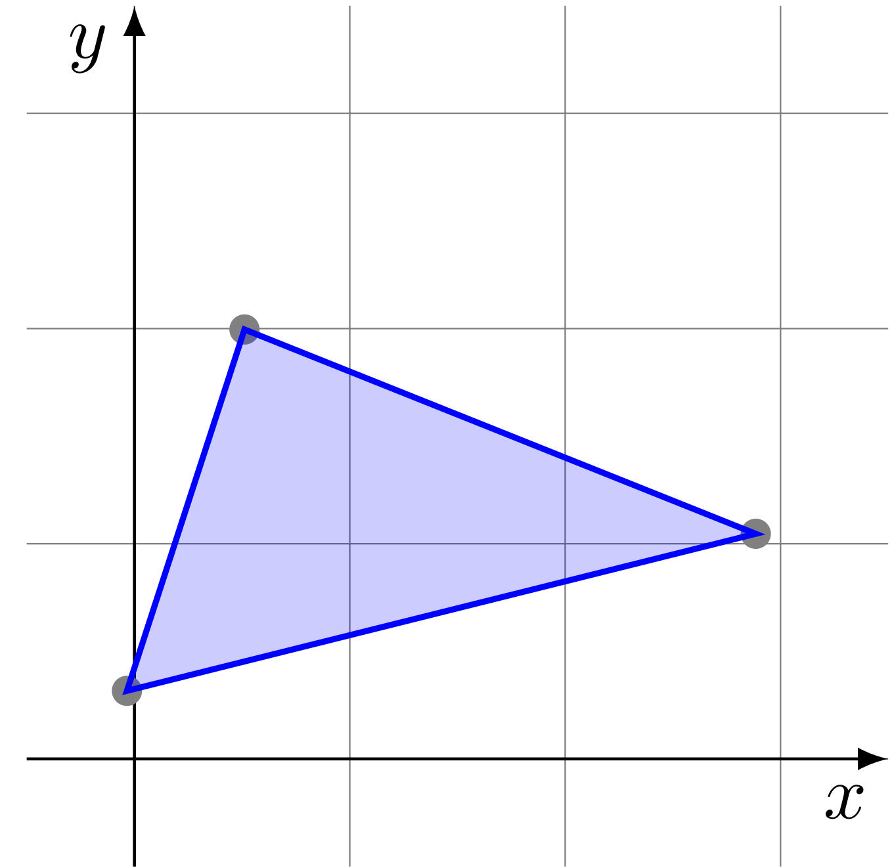

# Geometric {#geometric}

This section details the implementation of the data structures for representation of state sets and realted operations. variety designing of representations is mainly to balance computational complexity and accuracy. While some representations are able to perform certain operations very efficiently, other operations on the same representation, which are also needed for the analysis, can be computationally expensive. We only support **interval hull** and **polytope** by now. All the geometry representations inherit from the abstract **Geometry** class, all the pure virtual **API** should be overrided if you wanna define your own geometry representation. here are the **API**s:

## Interval Hull

An interval hull is represented by a group of intervals, one for each dimension of the state space.

 

    

## Polytope

We restrict ourselves to closed convex polytope, and it can be divided into
the following two categories according to the different representations.

### HPolytope

defined by a set of halfspaces, which given by a normal matrix **A** and related offset vector **B**

 

    

### VPolytope

defined by a set pf points which specify the convex hull of those points

 

    

