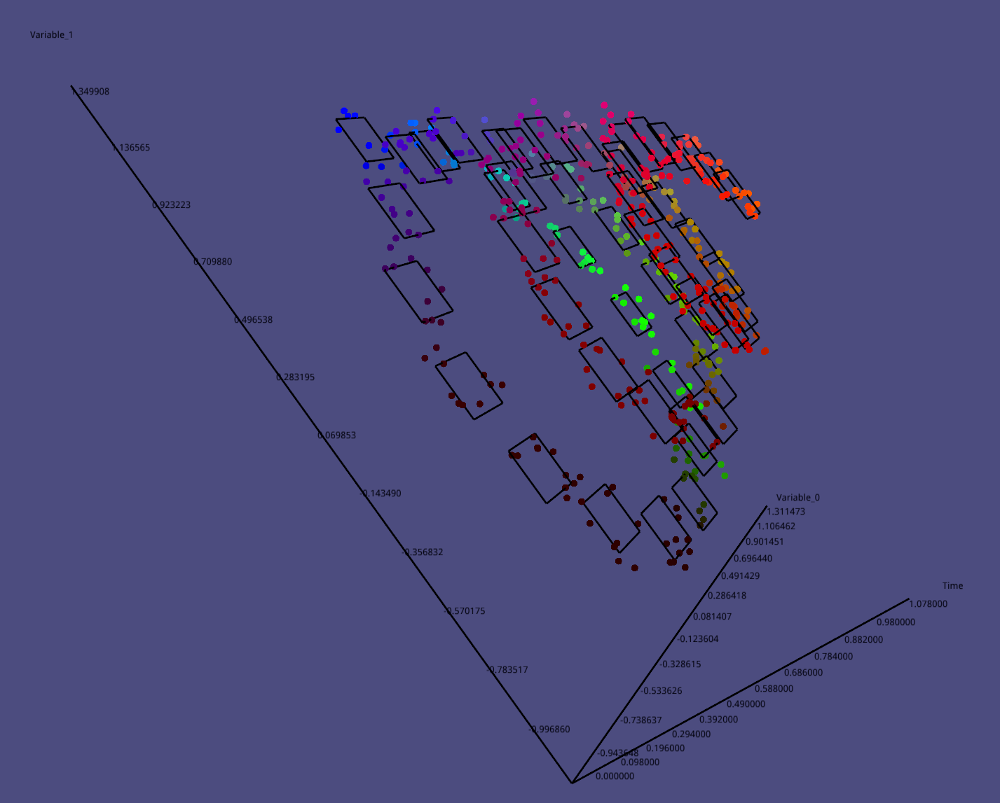

# Tutorial {#tutorial}

In this section, we will introduce you how to use this library to define your own algorithm and how to write the test cases, at the end of this section,
some options about the results plotting were provided.

## customize your own algorithm

For convenience, the concept of hybrid systems is referred to in the **Thomas A Henzinger**'s paper. Almost all decouplable modules in the accessibility process are decoupled
into separate computing modules. However, at present, we only allow users to
build specific accessibility analysis algorithms by customizing three modules
as follows:

### Analyser

The analyzer module is mainly used to solve the initial value problem, that
is to say, given the specified initial state set and the specified duration, as
well as the given continuous dynamic system, the module should return the state set that the continuous dynamic system can reach. Different
reach-ability analysis algorithms usually define their own specific calculation methods to get the reachable set in a certain time interval. Therefore, we
public the module, so that users can customize their own reach-ability set algorithm by customizing the actual calculation method within the Analyzer
module.

e.g. if you just want to get the over approximate state set in a duration,
you can simply call the solver which can return the over approximate set as
following:

```cpp
#pragma once

#include <irafhy/analyser.h>
#include <irafhy/representation/geometric/intervalHull.h>
#include "../settings/settings.h"

namespace irafhy
{
	class OAFAnalyser : public irafhy::Analyser
	{
	public:
		capd::C0Rect2Set compute(const irafhy::Time&	 duration,
		                         const irafhy::System&   system,
		                         const capd::C0Rect2Set& initCondition,
		                         const Settings&		 settings) const override;
	};
} // namespace irafhy
```

<div style="text-align: center;">
source code of ./algorithm/overApproximateForward/analyser/analyser.h
</div>

```cpp
#include "analyser.h"
#include <irafhy/utility/solver/ODESolver.h>

namespace irafhy
{
	capd::C0Rect2Set OAFAnalyser::compute(const irafhy::Time&	 duration,
	                                      const irafhy::System&   system,
	                                      const capd::C0Rect2Set& initCondition,
	                                      const irafhy::Settings& settings) const
	{
		try
		{
			return ODESolver::solve(system, initCondition, duration);
		}
		catch (const std::bad_cast& e)
		{
			std::cout << e.what() << std::endl;
			exit(EXIT_FAILURE);
		}
	}
} // namespace irafhy
```
<div style="text-align: center;">
source code of ./algorithm/overApproximateForward/analyser/analyser.cpp
</div>

As you can see, there is nothing special within the analyser but an ODE
solver calling. all you need to do is to define your own class which inherited from the pre-defined **Analyser** and overwrite the pure virtual method
compute. you can also define a relatively complex analyser class like this which implement the algorithm in **Xuebai**'s paper

```cpp
#pragma once

#include <irafhy/analyser.h>
#include <irafhy/representation/geometric/intervalHull.h>
#include <irafhy/representation/geometric/polytope.h>
#include "../settings/settings.h"
#include <omp.h>

namespace irafhy
{
	class UABPAnalyser : public Analyser
	{
	private:
		[[nodiscard]] std::vector<IntervalHull> boundary(const Condition& condition, double epsilon) const;
		[[nodiscard]] std::vector<IntervalHull> simulate(const Time&					  duration,
		                                                 const System&					  system,
		                                                 const std::vector<IntervalHull>& boundaryIntervalHulls) const;
		[[nodiscard]] Polytope					constructPolytope(const std::vector<IntervalHull>& boundary) const;
		[[nodiscard]] Polytope					contraction(const Polytope&					 polytope,
		                                                    const std::vector<IntervalHull>& boundary,
		                                                    bool							 isExact) const;

	public:
		[[nodiscard]] capd::C0Rect2Set compute(const Time&			   duration,
		                                       const System&		   system,
		                                       const capd::C0Rect2Set& initCondition,
		                                       const Settings&		   settings) const override;
	};
} // namespace irafhy
```

<div style="text-align: center;">
source code of ./algorithm/underApproximateBackwardUsingPolytope/analyser/analyser.h
</div>

### Verifier

The verifier module is another module you need to customize before testing your own algorithm. this module responsible for the verification of the running procedure. 
it is used to control whether the procedure should be terminated. the verification method will be called after each step. return **TRUE** means the algorithm can be run one more step. 
**FALSE** means the algorithm should not be running any more. you can customize your own verifier just like what we do in the previous subsection.

```cpp
#pragma once

#include <irafhy/verifier.h>
#include <irafhy/representation/formal/hybridAutomaton/hybridautomaton.h>

namespace irafhy
{
	class OAFVerifier : public Verifier
	{
	public:
		bool verify(const Settings& settings, const void* hybridAutomaton) const;
	};
} // namespace irafhy
```

<div style="text-align: center;">
source code of ./algorithm/overApproximateForward/verifier/verifier.h
</div>

```cpp
#include "verifier.h"

namespace irafhy
{
	bool OAFVerifier::verify(const Settings& settings, const void* hybridAutomaton) const { return true; }
} // namespace irafhy
```

<div style="text-align: center;">
source code of ./algorithm/overApproximateForward/verifier/verifier.cpp
</div>

for more complex verifier example, you can check the source code of the repository.

### Settings

It is inevitable to set some parameters related to the algorithm. For this part, we use \textbf{Settings} class to maintain all of them. you can customize your own \textbf{Settings} class to maintain the parameters you need and add some other methods you want. e.g.

```cpp
#pragma once

#include <irafhy/settings.h>

namespace irafhy
{
	class OAFSettings : public Settings
	{
	public:
		OAFSettings(const Settings& settings);

		void help() const override;
	};
} // namespace irafhy
```

<div style="text-align: center;">
source code of ./algorithm/overApproximateForward/settings/settings.h
</div>

:warning: It should be noted that the **Analyser**, **Verifier**, **Settings** should be in the namespace **irafhy**.

## configure the test case

All the configurations related to the test case should be defined into two files, one for **_Hybrid System_**, the other for **_Settings_**. e.g.

```html
HYBRID_AUTOMATON
{
    NAME Fitz Hugh Nagumo neuron model

    VARIABLES
    {
        x y
    }

    LOCATIONS
    {
        MODEL
        {
            NAME electron
            FLOWS
            {
                x'=x-x^3-y+(7/8)
                y'=0.08*(x+0.7-0.8*y)
            }
            INVARIANT_CONDITIONS
            {
            }
        }
    }

    TRANSITIONS
    {
    }
}
```

<div style="text-align: center;">
source code of model.mdl
</div>

```html
SETTINGS
{
    TIME_HORIZON := [0,0.2]
    STEP := 0.02
    GEOMETRY := INTERVAL_HULL
    PLOT := ON
    PRINT := OFF
    ANALYSIS := FORWARD
    START_MODEL_ID := electron #name of the model
    INITIAL_CONDITION :=
    CONDITION
    {
        INTERVAL_HULL
        {
            [0.5,1.5],
            [2.0,3.0]
        }
    }
}
```

<div style="text-align: center;">
source code of setting.cfg
</div>

once two files done, the parameter inside shall be parsed by the parser only if you use the right name of the parameter and the set it to the right value.

## view the results

The results can be plotted once the results generated, you can simply call the **show** method of class **viewer** to view them. the viewer current is generally an unpolished tool which supports limited viewing options, it will be improved future.

```cpp
irafhy::viewer::show(
					this->intervalHulls_, 
					this->points_, 
					this->time_, {0, 1, 2}, 
					irafhy::VIEW_TYPE::LINE);
```

as you can see, you should provide the geometry objects, points, the time intervals, the dimensions and the style of the plotting. here is a piece of screenshot showing a bunch of 3D interval hulls, some points and time intervals which indicate when these geometry objects generated. even the _dimension_ values set to _{0,1,2}_, the viewer still just show 2D interval hulls cause the time intervals provided.

<br />
<p align="center">
    
</p>

## References

*  Thomas A Henzinger. The theory of hybrid automata. In Verification of
digital and hybrid systems, pages 265–292. Springer, 2000
* Bai Xue, Zhikun She, and Arvind Easwaran. Under-approximating backward reachable sets by polytopes. In International Conference on Computer Aided Verification, pages 457–476. Springer, 2016
* Alec Jacobson, Daniele Panozzo, et al. libigl: A simple C++ geometry
processing library, 2018. https://libigl.github.io/