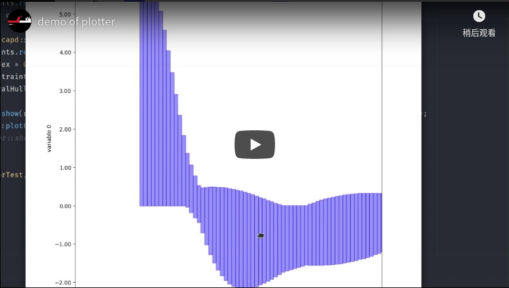
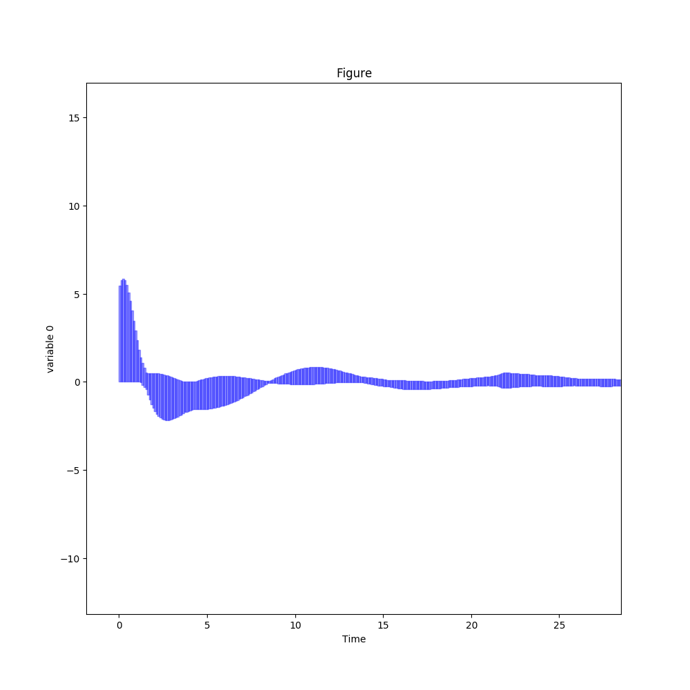
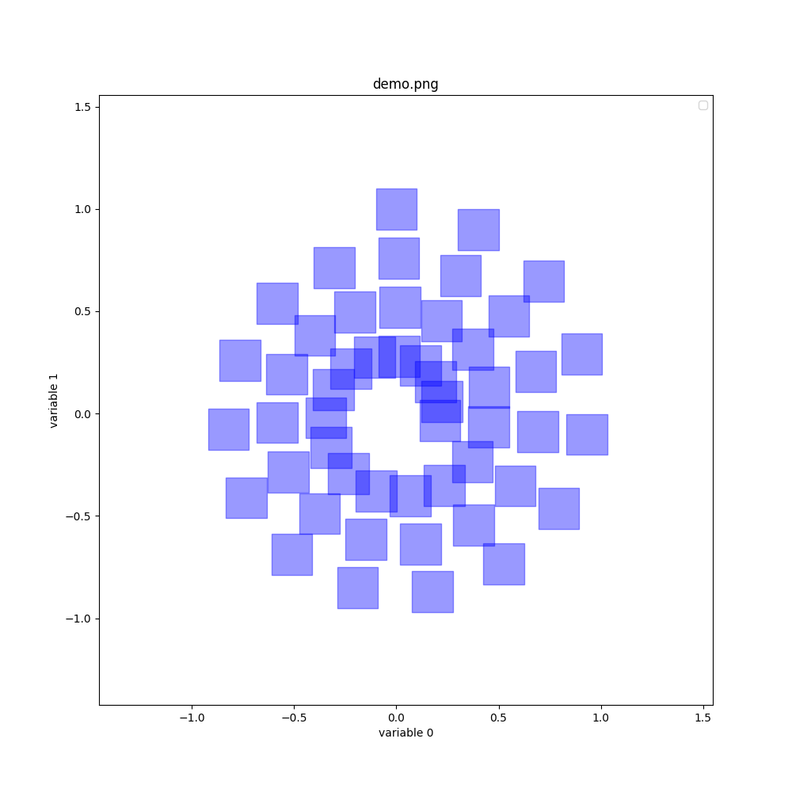

# Plotter {#plotter}

We also wrapper a plotter to help the user to plot the results in specified dimensions, for more details about the plotter, you can check the repository of [lava](https://github.com/lava/matplotlib-cpp).

here is an [online video](https://www.youtube.com/watch?v=NAhR8njwbDU) of plotter

 

    

Once all the configurations have been adjusted, you can save the result as an image.

 

    

 

    

