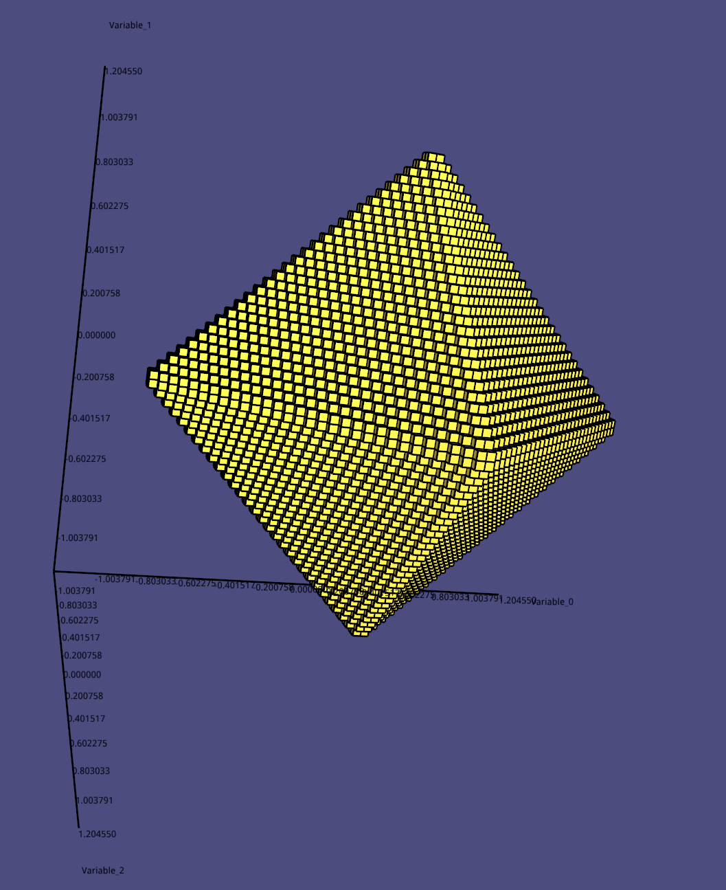
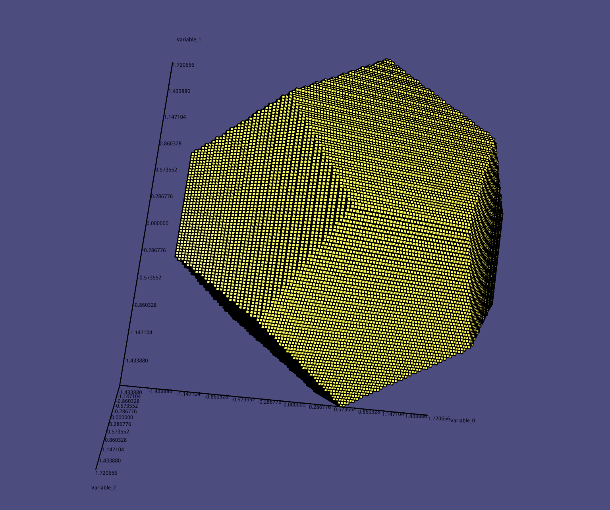

# Solver {#solver}

There are so many solvers written in different languages, rigorous or non-rigorous. we restrict to rigorous ordinary differential equations solver and constraints sanctification problem solver.

## Constraints Satisfaction Problem solver

[IBEX](http://www.ibex-lib.org/) is the most current active library designed for constraint processing over real numbers in C++, previously, 
[Realpaver](http://pagesperso.lina.univ-nantes.fr/~granvilliers-l/realpaver/) is one of the most popular library for  nonlinear constraint 
solving and rigorous global optimization(it seems that without maintenance any more). most of these libraries lack of providing **API**s
 for getting boundary of the target domain. so we implement our own solver which can get the boundary boxes of the target domain.
e.g. given the constraints of an octahedron, you can get all the interval hulls which bounding the boundary of the domain defined by the given octahedron.
here is a screen shot of these interval hulls.

 

    

or the boundary interval hulls of a dodecahedron.

 

    

It should be noted that, for getting the boundary interval hulls of an interval hull, it is recommended that you should use the "EXACT" method, which will return
 the exact boundary of the given interval hull, not interval hulls enclosing the boundary.

**WARNING**: We only support to get the boundary boxes of the convex hull so far. 

## Ordinary Differential Equations solver

We wrap the third party library [CAPD](http://capd.ii.uj.edu.pl/) as our ODE solver. for more details about CAPD, please check its official website.